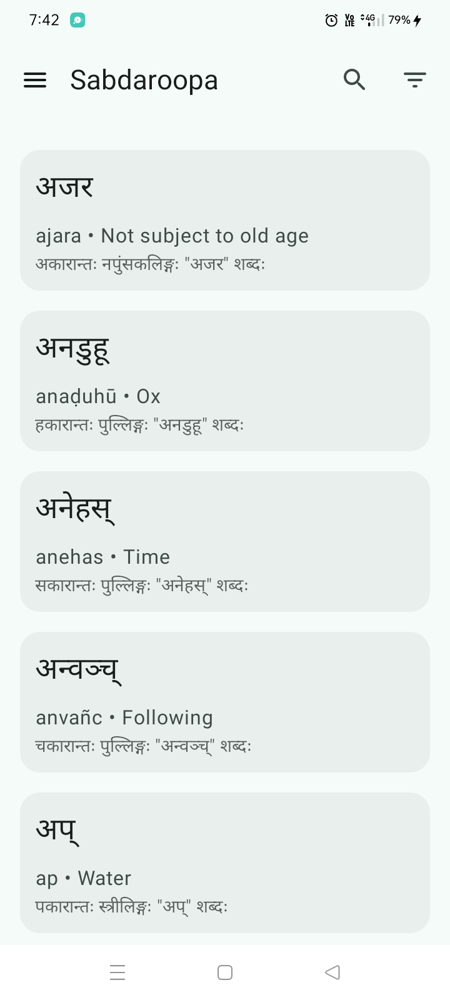
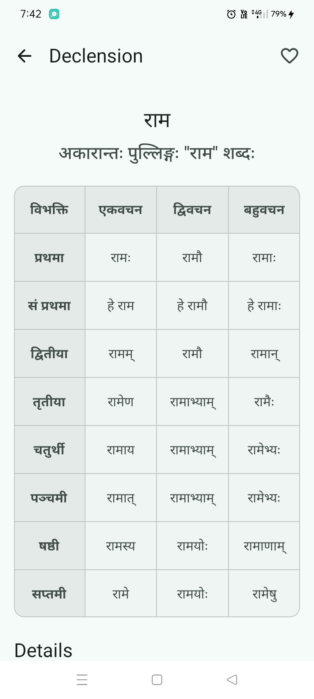
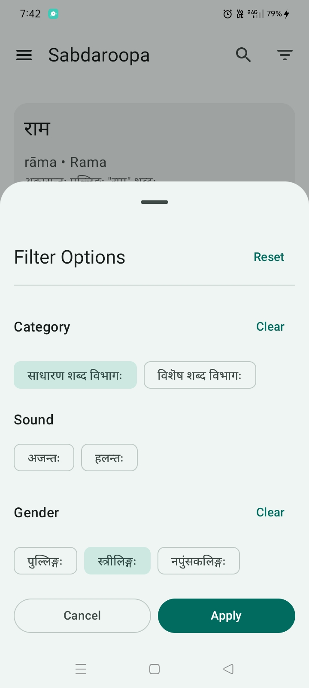
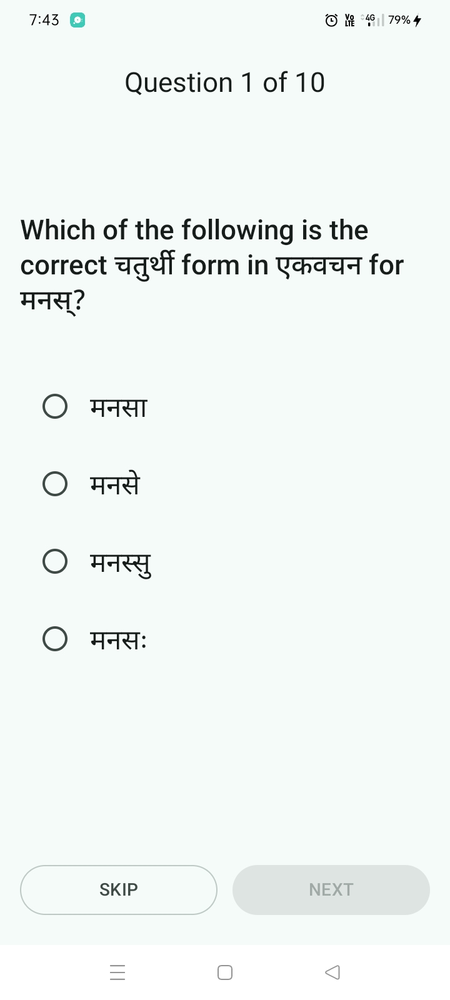
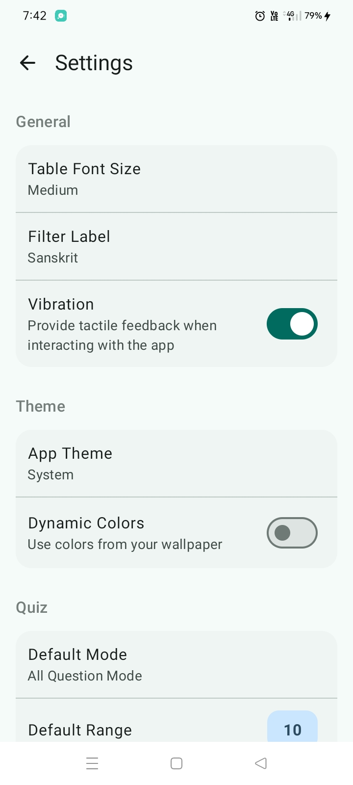
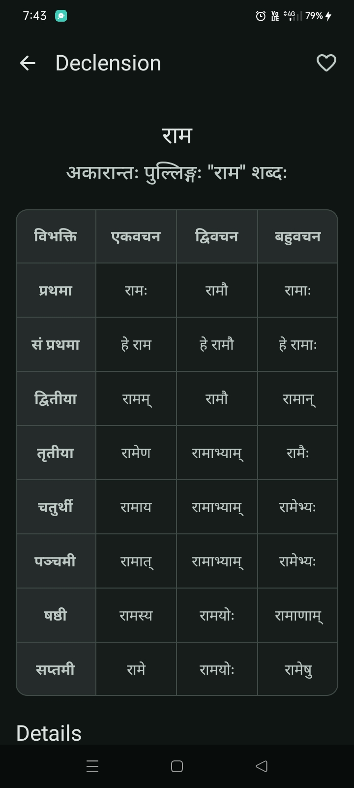

# सब्दरूप (Sabdaroopa)

[](https://www.android.com/)
[](https://kotlinlang.org/)
[](https://github.com/nxzef/sabdaroopa)
[](COPYRIGHT)

> Your offline companion for learning Sanskrit grammar

An Android application designed to simplify Sanskrit declension table learning by providing structured, interactive, and offline access to Sanskrit word declensions. Built as an academic project for BA Sanskrit at University of Calicut.

**© 2025 Mohammed Naseef V M. All Rights Reserved.**

---

## ⚠️ Copyright Notice

This project is **All Rights Reserved**. The code is publicly viewable for **portfolio and educational purposes only**. See [COPYRIGHT](COPYRIGHT) for full terms.

**NOT licensed for:**
- ❌ Redistribution
- ❌ Commercial use
- ❌ Republishing on app stores
- ❌ Creating derivative works

**Contact nx.naseef@gmail.com for permissions.**

---

## 📱 Screenshots

<div align="center">
  
  
  
</div>

<div align="center">
  
  
  
</div>

---

## ✨ Features

- **📚 125+ Sanskrit Words** - Complete declension tables organized by categories
- **🔍 Advanced Search** - Search by meaning, Devanagari script, or IAST transliteration
- **📱 100% Offline** - No internet required, all data stored locally
- **🎯 Interactive Quiz Mode** - Test your knowledge with built-in quizzes
- **⭐ Favorites** - Save frequently used words for quick access
- **🎨 Material Design 3** - Modern, beautiful user interface
- **🌓 Theme Support** - Light and Dark themes with dynamic colors (Android 12+)
- **⚙️ Customizable** - Adjustable font sizes, vibration feedback, and preferences
- **🗂️ Organized Categories**
  - साधारण शब्द विभागः (General Words)
  - विशेष शब्द विभागः (Specific Words)
- **🔤 Smart Filters** - Filter by vowel/consonant endings and gender (पुल्लिङ्गः, स्त्रीलिङ्गः, नपुंसकलिङ्गः)

---

## 🎯 Motivation

This app was born from a unique vision during my final year as a BA Sanskrit student at SNGS College, Pattambi (2022-2025). While peers wrote traditional books on Mahabharata and Ramayana, I chose to do something different—something that had never been done in our college before: **build an Android app**.

Traditional Sanskrit grammar resources are limited to printed books and PDFs, making it difficult to quickly find and analyze word declensions. Sabdaroopa bridges this gap by providing an interactive, searchable, and structured digital platform for Sanskrit learners.

---

## 🏗️ Architecture

This project follows **Clean Architecture** principles with **MVVM** (Model-View-ViewModel) pattern:

```
┌─────────────────────────────────────┐
│         Presentation Layer          │
│    (Jetpack Compose + ViewModels)   │
└─────────────┬───────────────────────┘
              │
┌─────────────▼───────────────────────┐
│          Domain Layer               │
│  (Use Cases, Business Logic, etc.)  │
└─────────────┬───────────────────────┘
              │
┌─────────────▼───────────────────────┐
│           Data Layer                │
│  (Room Database + Repositories)     │
└─────────────────────────────────────┘
```

### Key Components:

- **UI Layer**: Jetpack Compose with Material Design 3
- **ViewModel**: State management with StateFlow
- **Repository**: Data abstraction layer
- **Room Database**: Pre-packaged SQLite database with 125+ words
- **Dependency Injection**: Hilt for clean dependency management

---

## 🛠️ Tech Stack

| Component | Technology |
|-----------|-----------|
| **Language** | [Kotlin](https://kotlinlang.org/) |
| **UI Framework** | [Jetpack Compose](https://developer.android.com/jetpack/compose) |
| **Architecture** | MVVM + Clean Architecture |
| **Dependency Injection** | [Hilt](https://dagger.dev/hilt/) |
| **Database** | [Room](https://developer.android.com/training/data-storage/room) (SQLite) |
| **Async** | Kotlin Coroutines + Flow |
| **Navigation** | Jetpack Navigation Compose |
| **Design System** | Material Design 3 |
| **Data Storage** | DataStore (Preferences) |

---

## 📦 Project Structure

```
com.nxzef.sabdaroopa/
├── data/
│   ├── local/          # Room database, DAOs
│   ├── model/          # Data models & entities
│   └── repository/     # Repository implementations
├── di/                 # Hilt dependency injection modules
├── domain/
│   ├── manager/        # App-wide managers (HapticManager, FocusManager)
│   └── platform/       # Platform capabilities
├── ui/
│   ├── component/      # Reusable UI components
│   ├── screen/         # Feature screens
│   │   ├── home/       # Word list (main screen)
│   │   ├── table/      # Declension table view
│   │   ├── favorites/  # Saved favorites
│   │   ├── quiz/       # Quiz feature
│   │   ├── settings/   # App settings
│   │   └── about/      # About screen
│   └── theme/          # Theme, colors, typography
└── utils/              # Extension functions, helpers
```

---

## 📊 Database Schema

The app uses a pre-packaged Room database with the following structure:

```kotlin
@Entity(tableName = "sabda")
data class Sabda(
    @PrimaryKey(autoGenerate = true) 
    val id: Int,
    
    // Basic Information
    val word: String,              // Sanskrit word (Devanagari)
    val meaning: String,           // English meaning
    val translit: String,          // IAST transliteration
    val translitNormalized: String, // Normalized for search
    val anta: String,              // Word ending
    
    // Classification
    val category: Category,        // General/Specific
    val gender: Gender,            // पुल्लिङ्गः/स्त्रीलिङ्गः/नपुंसकलिङ्गः
    val sound: Sound,              // Vowel/Consonant ending
    
    // User Data
    val isFavorite: Boolean,       // Favorite status
    val favoriteSince: Long?,      // Timestamp
    val visitCount: Int,           // Number of views
    val lastVisited: Long?,        // Last viewed timestamp
    
    // Declension Data
    val declension: Declension     // Full declension table (8×3 grid)
)
```

**Declension Structure**: 8 cases (विभक्ति) × 3 numbers (वचन) = 24 forms per word

**Database Features**:
- Indexed columns for fast filtering (category, gender, sound)
- Full-text search support
- Pre-packaged with 125+ words
- Size: ~500KB

---

## 🎨 Design Decisions

### Why Jetpack Compose?
- Modern declarative UI paradigm
- Less boilerplate than XML layouts
- Built-in state management
- Smooth animations out-of-the-box
- Better performance and maintainability

### Why Room Database?
- Offline-first architecture
- Type-safe database queries
- Compile-time verification
- Pre-packaged database support
- Efficient caching and indexing

### Why MVVM Architecture?
- Clear separation of concerns
- Testable business logic
- Lifecycle-aware components
- Easy state management with StateFlow
- Industry-standard pattern

### Why Material Design 3?
- Modern, accessible design language
- Dynamic color theming (Android 12+)
- Consistent user experience
- Built-in accessibility features

---

## 📝 Development Journey

**Timeline**: December 2024 - June 2025 (6-7 months)

### Challenges Overcome:
- ⏰ **Late nights** - Balancing academics with development
- 🏥 **Health struggles** - Pushing through physical challenges
- 📚 **Learning curve** - Mastering Kotlin & Jetpack Compose from scratch
- 🎨 **Custom UI** - Designing declension table layouts without existing components
- 💾 **Database optimization** - Efficient data storage and retrieval
- 🔍 **Search implementation** - Multi-field search with normalization

### My Programming Journey:
```
10th Standard → HTML/CSS → JavaScript → React → React Native → Flutter → Kotlin
```

This is my **first complete Android app**, built entirely while learning! Every line of code represents hours of research, debugging, and iteration.

---

## 📚 Data Sources

The declension data (125+ words) was **manually extracted and compiled** from:

- **Sabda Manjari** - Primary reference book for Sanskrit declensions
- **My Coaching** - Sanskrit grammar lessons and resources
- **Learn Sanskrit** - Educational grammar references
- **Sanskrit Abhyas** - Practice materials and examples

> Note: Data compilation represents significant original work in digitizing traditional Sanskrit grammar resources.

---

## 🎓 Academic Context

| Detail | Information |
|--------|-------------|
| **Project Type** | Final Year Academic Project |
| **Degree** | Bachelor of Arts (BA) in Sanskrit |
| **Duration** | 2022-2025 (3 years) |
| **College** | Sree Neelakanta Government Sanskrit College (SNGS), Pattambi |
| **University** | University of Calicut, Kerala, India |
| **Project Guide** | Dr. Rajalakshmy M<br/>Associate Professor, Department of Sanskrit |
| **Head of Department** | Dr. A. Vasu<br/>Department of Sanskrit |
| **Submission** | 6th Semester (2025) |

---

## 🙏 Acknowledgments

### Project Guide
**Dr. Rajalakshmy M**  
*Associate Professor, Department of Sanskrit, SNGS College, Pattambi*

For her invaluable guidance, continuous support, and encouragement throughout the development of this project. Her insights into Sanskrit grammar and pedagogical approaches shaped the app's structure and usability.

### Head of Department
**Dr. A. Vasu**  
*Head of Department, Sanskrit, SNGS College, Pattambi*

For approving this innovative project approach and providing valuable suggestions that guided its direction. His support made it possible to pursue a technical solution for a traditional subject.

### Special Thanks
- **Varsha** - For generously providing the 'Sabda Manjari' reference book, which became the foundation of the app's data
- **Gopi Krishnan** - For continuous moral support and encouragement throughout the development process
- **My Peers** - All friends in the Sanskrit department who encouraged this unconventional project approach
- **My Family** - For supporting me through late nights and challenges

---

## 🔒 Copyright & Usage

**© 2025 Mohammed Naseef V M. All Rights Reserved.**

This is an academic project with **All Rights Reserved** copyright protection. See [COPYRIGHT](COPYRIGHT) file for complete terms.

### What This Means:

✅ **Allowed**:
- View code for learning and reference
- Use as example in educational context
- Review for recruitment/hiring purposes
- Fork for personal study (not for redistribution)

❌ **Not Allowed**:
- Republish on Google Play Store or any app marketplace
- Use commercially without permission
- Create derivative works for distribution
- Copy code into other projects
- Modify and redistribute

### Why Public Repository?

This repository is public to:
1. 📋 **Showcase work** to potential employers and recruiters
2. 🎓 **Demonstrate skills** in modern Android development
3. 📚 **Educational reference** for other students
4. 🔍 **Portfolio piece** for job applications

### For Permissions:

For licensing inquiries, collaboration, or usage permissions:
- 📧 Email: nx.naseef@gmail.com
- 💼 LinkedIn: [linkedin.com/in/nxzef](https://www.linkedin.com/in/nxzef/)
- 🐙 GitHub: [@nxzef](https://github.com/nxzef)

---

## 📞 Contact

**Mohammed Naseef V M**  
BA Sanskrit Student (2022-2025) | Android Developer

- 📧 **Email**: [nx.naseef@gmail.com](mailto:nx.naseef@gmail.com)
- 💻 **GitHub**: [@nxzef](https://github.com/nxzef)
- 💼 **LinkedIn**: [nxzef](https://www.linkedin.com/in/nxzef/)
- 🎓 **Institution**: SNGS College, Pattambi | University of Calicut

**Open to**:
- Full-time Android Developer positions
- Internship opportunities
- Freelance projects
- Technical collaborations

---

## 📊 Project Statistics

| Metric | Value |
|--------|-------|
| **Development Time** | 6-7 months (Dec 2024 - Jun 2025) |
| **Words in Database** | 125+ Sanskrit words |
| **Database Size** | ~500KB |
| **Target Android** | API 24+ (Android 7.0+) |
| **Min SDK** | 24 |
| **Target SDK** | 34 (Android 14) |
| **Primary Language** | Kotlin |
| **UI Framework** | Jetpack Compose |

<!-- TODO: Update these after final build:
To get these values, run in your project folder:
- Lines of Code: `find app/src -name "*.kt" | xargs wc -l`
- Number of Files: `find app/src -name "*.kt" | wc -l`
- Commit Count: `git log --oneline | wc -l`
- APK Size: Check release APK file properties

Then add to table above:
| **Lines of Code** | ~XX,XXX lines |
| **Kotlin Files** | XX files |
| **Commits** | XXX commits |
| **APK Size** | XX.X MB |
-->

---

## 🐛 Known Issues

No known critical issues at this time. The app has been thoroughly tested and is production-ready.

If you discover a bug or unexpected behavior, please report it via email: **nx.naseef@gmail.com**

Include:
- Description of the issue
- Steps to reproduce
- Expected vs actual behavior
- Screenshots (if applicable)
- Device info (Android version, manufacturer)

---

## 📱 Download & Installation

### 🚀 Coming Soon on Google Play Store!

The app is **production-ready** and will be available for download on Google Play Store shortly, following academic submission and evaluation.

**Status**: ✅ Development Complete | 🔄 Awaiting Play Store Submission

---

### For Developers (Educational Reference):

**Prerequisites**:
- Android Studio Hedgehog (2023.1.1) or later
- JDK 17 or higher
- Android SDK (Min: 24, Target: 34)
- Kotlin 1.9.0+

**Note**: This repository is for educational reference and portfolio demonstration. Creating derivative works or redistributing is not permitted without explicit permission. See [COPYRIGHT](COPYRIGHT) for full terms.

---

## 🎯 Why This Project Matters

### Breaking Traditional Barriers

For the first time in SNGS College Pattambi's history, a student chose to build a mobile application as an academic project instead of writing a traditional book. This project demonstrates:

1. **Innovation in Education** - Bringing ancient Sanskrit grammar into the digital age
2. **Accessibility** - Making learning resources available to anyone with a smartphone
3. **Preservation** - Digitizing traditional knowledge for future generations
4. **Bridge Building** - Connecting classical education with modern technology

### Impact

- 📱 **First of its kind** - First Android app academic project in college history
- 🎓 **Educational tool** - Helps students learn grammar interactively
- 🌍 **Accessible** - Works offline, no internet barriers
- 💡 **Innovative** - Demonstrates tech can enhance traditional subjects

---

## 🔮 Project Status

**Current Status**: ✅ **Production Ready**

- [x] Core features implemented
- [x] 125+ words with complete declensions
- [x] Quiz functionality
- [x] Favorites system
- [x] Settings & customization
- [x] Material Design 3 UI
- [x] Dark/Light themes
- [x] Offline support
- [x] Testing completed
- [x] Academic submission complete
- [ ] Google Play Store publication (in progress)

**Next Steps**:
1. Google Play Store submission
2. Public release
3. User feedback collection
4. Continuous improvements

---

## 📖 Documentation

For detailed information about the project, see:

- [COPYRIGHT](COPYRIGHT) - Full copyright and usage terms
- [CONTRIBUTING.md](CONTRIBUTING.md) - Contribution guidelines
- Academic Project Report (Submitted to University of Calicut, 2025)

---

## 💡 For Recruiters & Employers

This project demonstrates:

### ✅ Technical Skills
- Modern Android development (Kotlin, Jetpack Compose)
- Clean Architecture & MVVM pattern
- Database design & optimization (Room)
- State management (StateFlow, ViewModel)
- Dependency injection (Hilt)
- Material Design 3 implementation
- Git version control

### ✅ Soft Skills
- **Self-learning** - Learned Kotlin & Compose from scratch
- **Problem-solving** - Overcame technical challenges independently
- **Time management** - Balanced academics with 6-7 month development
- **Persistence** - Completed despite health and time challenges
- **Innovation** - First student in college to do this type of project
- **Documentation** - Well-documented code and project materials

### ✅ Project Management
- Long-term project execution (6-7 months)
- Academic deadline adherence
- Quality-focused development
- User-centric design approach
- Production-ready delivery

**Available for**: Full-time Android Developer roles, internships, or freelance projects.

---

<div align="center">

### ⭐ If this project interests you, please star the repository!

**Made with ❤️ and countless cups of coffee**

**Mohammed Naseef V M**  
*BA Sanskrit Student | Android Developer*  
*University of Calicut | 2025*

---

**© 2025 Mohammed Naseef V M. All Rights Reserved.**

*This is an academic project. Unauthorized reproduction, distribution, or commercial use is prohibited.*

</div>
